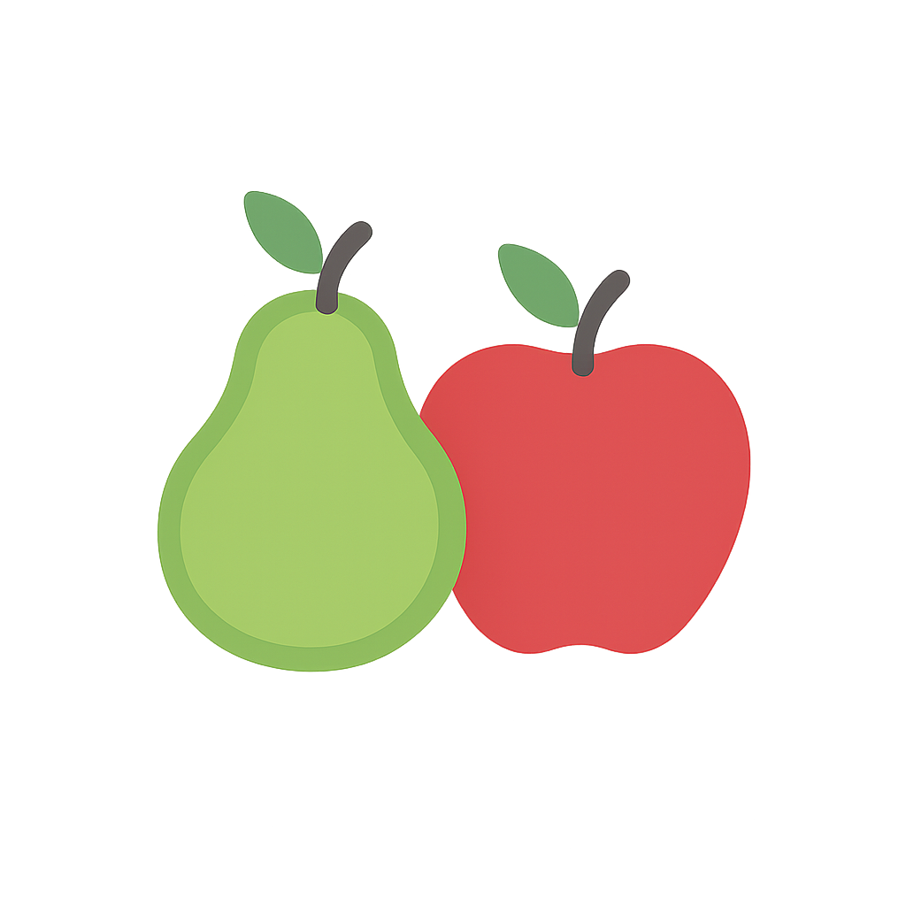
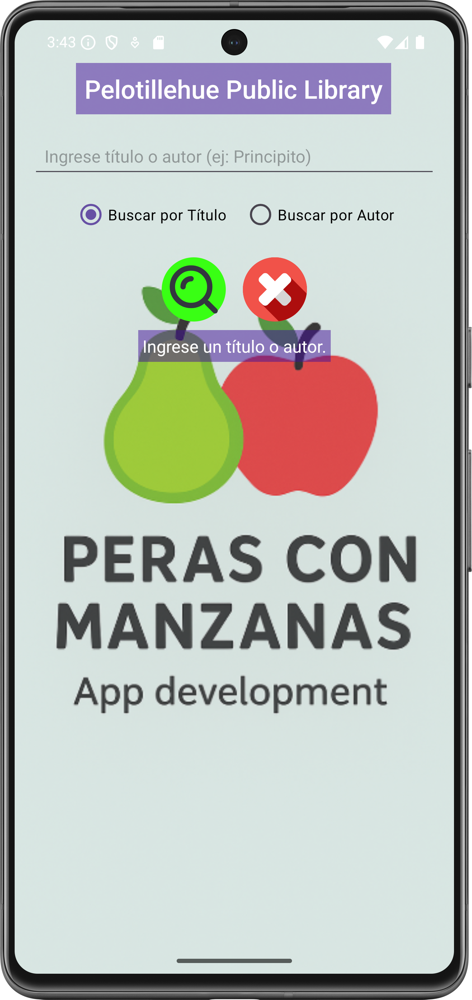
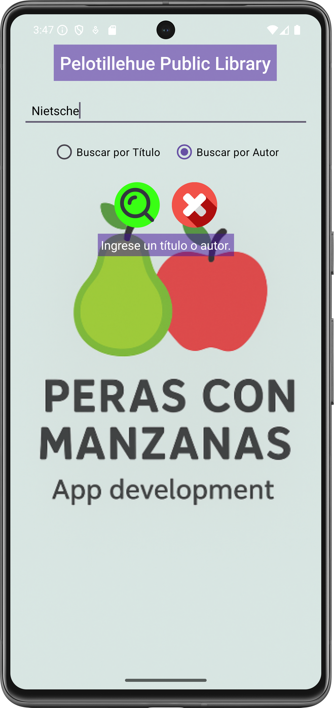
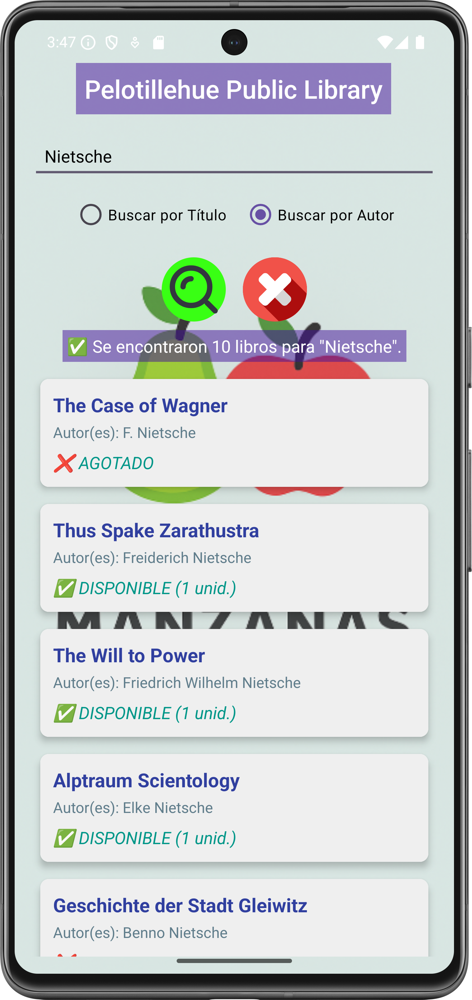
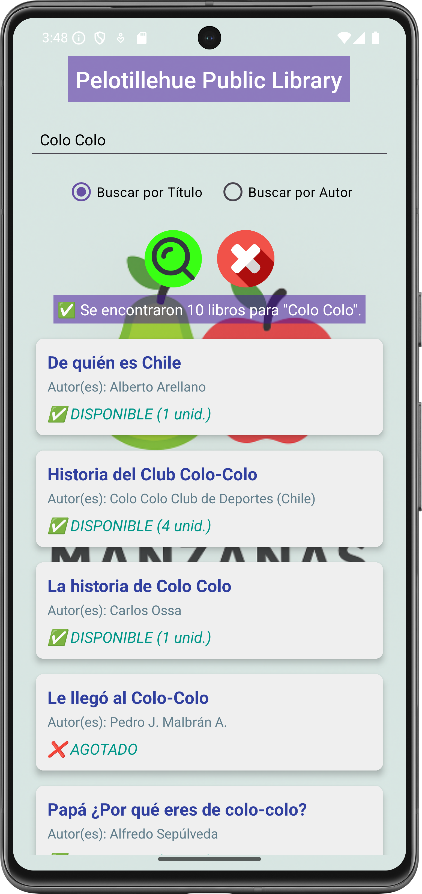
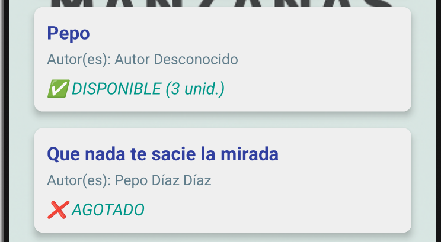

# APIBOOKS V1 - ARQUITECTURA MVVM, COROUTINES, RETROFIT Y GESTIÓN DE JOB

<p float="center">
  
</p>

Este proyecto es una refactorización de la aplicación "API Climática (ApiClima, AE4-ABP1)" que se usa como base para crear a una nueva mini aplicación nativa para Android, desarrollada por **Peras con Manzanas** en Kotlin.

Su objetivo principal es ilustrar y aplicar la arquitectura **MVVM (Model-View-ViewModel)**, manteniendo la implementación de **Kotlin Coroutines** y otros aspectos comunes, para el manejo eficiente de operaciones de red asíncronas, la gestión de dependencias con **Retrofit**, y la cancelación controlada de tareas mediante un **Job**. La aplicación simula un sistema de consultas para la **"Pelotillehue Public Library"** utilizando la API de Google Books.

---

## 🏗️ Arquitectura y Flujo de Datos (MVVM)

Se migró la aplicación, desde una arquitectura básica para MVP (single-activity), a **MVVM** para desacoplar la lógica de negocio de la interfaz de usuario.

| Componente                            | Función en APIBooks                                                                                                                     | Tecnologías                                |
| :------------------------------------ | :-------------------------------------------------------------------------------------------------------------------------------------- | :----------------------------------------- |
| **View (MainActivity)**               | Muestra la UI (EditText, RecyclerView) y **observa** los LiveData del ViewModel para actualizar la vista.                               | `RecyclerView`, `LiveData`, `Observer`     |
| **ViewModel (BookViewModel)**         | Contiene la lógica de negocio, gestiona el estado de la UI (`isLoading`, `statusMessage`) usando **LiveData**, e inicia las Coroutines. | `ViewModelScope`, `LiveData`, `Coroutines` |
| **Model/Repository (BookRepository)** | Encapsula la lógica de acceso a datos (llamada a la API) y la lógica de negocio simulada (disponibilidad y stock).                      | `RetrofitInstance`, Lógica de Simulación   |

---

## Requerimientos Funcionales Implementados

1. **Consulta de Catálogo (API)**: Consulta el catálogo de libros a través de la API pública de **Google Books**.
2. **Criterios de Búsqueda**: El usuario puede refinar la búsqueda por:
   - **Título** (`intitle :` en la API).
   - **Autor** (`inauthor:` en la API).
3. **Simulación de Biblioteca**: Se implementó una lógica de negocio que **simula la disponibilidad** (`Disponible`/`Agotado`) y el **Stock** de los libros mediante una función que usa _random_ en el `BookRepository`.
4. **Manejo Asíncrono**: Utiliza Kotlin Coroutines (`launch`, `async`, `await`, `withContext`) en el **ViewModel** para ejecutar las operaciones de red (`Dispatchers.IO`).
5. **Presentación de Resultados**: Usando **cards** y scroll layout, muestra la lista de resultados de la consulta en un **RecyclerView** que se actualiza reactivamente al cambiar el `LiveData` (`books`).

---

## Funcionamiento de Coroutines y JOB (Se heredó de ApiClima y se mantuvo)

La gestión de procesos concurrentes se trasladó por completo al `BookViewModel` utilizando, de acuerdo a las buenas prácticas, al `viewModelScope`, asegurando que el ciclo de vida de las tareas esté ligado al ViewModel.

- **Cancelación Segura**: El `viewModelScope` cancela automáticamente todas las Coroutines asociadas cuando el ViewModel se destruye (`onCleared()`), previniendo **fugas de memoria** (Leaks).
- **Cancelación Manual**: Cómo se herredó, el botón "Cancelar", ahora llama a `viewModel.cancelCurrentSearch()`, abortando la operación de red en curso si el usuario la interrumpe, antes de los 3000ms.
- **Simulación de Concurrencia**: Se mantiene la demostración del uso de `async` y `await` para ejecutar múltiples subtareas concurrentemente (la consulta real a la API y un `delay(3000ms)` para simular la larga espera y mostrar el **ProgressBar**).

---

## Funcionamiento de Retrofit

El cliente HTTP **Retrofit** se utiliza en la capa del `BookRepository`.

1. **Interfaz del Servicio**: Se define `BooksApiService` con el _endpoint_ `/volumes?q={query}` de Google Books.
2. **Serialización**: `Gson` convierte automáticamente la respuesta JSON de la API en la estructura de datos de Kotlin (`BooksResponse`, `BookItem`, `VolumeInfo`).
3. **Nota sobre API Key**: A diferencia de la versión V1 (Clima), la API de Google Books **no requiere una API Key** para búsquedas de datos públicos, por lo que el parámetro no es requerido en la configuración.

---

## Tecnologías Usadas 🛠️

- **Arquitectura**: MVVM (Model-View-ViewModel)
- **Lenguaje**: Kotlin (1.9.22)
- **Networking**: Retrofit 2.x
- **Serialización**: Gson Converter
- **Concurrencia**: Kotlin Coroutines (Dispatchers, Job, viewModelScope)
- **UI**: LiveData, RecyclerView, Single-Activity.
- **API externa**: Google Books API
- **Otros**: Git, Android Studio.

---

## Funcionamiento de la Aplicación

La aplicación es un prototipo funcional para demostrar las capacidades arquitectónicas y de concurrencia.

1. **Pantalla de Inicio**: Muestra un campo de búsqueda (`etQuery`) y opciones para buscar por **Título** o **Autor**.
2. **Al presionar "Buscar"**:
   - Se activa el **ProgressBar** y se muestra el mensaje de estado (observado por LiveData).
   - El `BookViewModel` lanza un nuevo Job que contiene la llamada a la API y el `delay(2000ms)`.
   - Al completarse, el `LiveData` de la lista de libros se actualiza y el **RecyclerView** muestra los resultados, incluyendo el estado de disponibilidad simulado.
3. **Al presionar "Cancelar"**:
   - `job.cancel()` es invocado desde el ViewModel, interrumpiendo la tarea de red y el delay simulado.
   - Se muestra el mensaje "Búsqueda cancelada 🚫".

---

## Capturas de Pantalla

<p float="left">
    
  
  
  
  
</p>

---

## Guía de Ejecución del Proyecto

**Para ejecutar este proyecto en tu entorno de desarrollo, siga estos 'quick steps':**

1.**Clonar el Repo:** Clona el proyecto en su máquina local.

2.**Abrir en Android Studio:** Abra la carpeta del proyecto con Android Studio. El IDE detectará automáticamente la configuración de Gradle.

3.**Sincronizar Gradle:** Haz clic en el botón "Sync Now" si Android Studio te lo solicita. Esto descargará todas las dependencias necesarias.

4.**Ejecutar:** Conecta un dispositivo Android físico o inicia un emulador. Luego, haz clic en el botón "Run 'app'" (el ícono de la flecha verde) para desplegar la aplicación.

**Para ejecutar este proyecto en tu celular, sigue estos 'quick steps':**

1.**Copiar la APK:** Copia la aplicación (APK) en tu celular.

2.**Instalar:** Instala la aplicación, salta los avisos de advertencia, es normal si la aplicación no ha sido productivizada la plataforma de Android.

3.**Abrir la App:** Haz doble clic en el ícono "Agenda".

4.**Recorrer las opciones:** Cliquea en las opciones y podrás acceder al listado de eventos, editar cada evento, crear nuevos eventos, regresando a cualquier punto de la app.

---

## Instalación y Configuración

a. **Clonar el repositorio:**

```bash


https://github.com/jcordovaj/ae4_abpro1_ApiLibros.git


```

b. **Abrir el Proyecto en Android Studio:**

b.1. Abrir Android Studio.

b.2. En la pantalla de bienvenida, seleccionar **"Open an existing Android Studio project"** (Abrir un proyecto de Android Studio existente).

b.3. Navegar a la carpeta donde se clonó el repositorio y seleccionarla. Android Studio detectará automáticamente el proyecto de Gradle y comenzará a indexar los archivos.

c. **Sincronizar Gradle:**

c.1. Este es el paso más importante. Después de abrir el proyecto, Android Studio intentará sincronizar la configuración de Gradle. Esto significa que descargará todas las librerías, dependencias y plugins necesarios para construir la aplicación. Normalmente, una barra de progreso se mostrará en la parte inferior de la consola de Android Studio con un mensaje como **"Gradle Sync in progress"**.

c.2. Si no se inicia, o si el proceso falla, intente con el botón **"Sync Project with Gradle Files"** en la barra de herramientas. Es el icono con el **"elefante" de Gradle**. Eso forzará la sincronización.

c.3. Esperar que el proceso de sincronización termine. De haber errores, puede ser por problemas en la configuración de Android u otros conflictos, la aplicación debe descargar lo que requiera y poder ser ejecutada "AS-IS".

d. **Configurar el Dispositivo o Emulador:**

Para ejecutar la aplicación, se requiere un dispositivo Android, puedes usarse el emulador virtual o un dispositivo físico.

d.1. Emulador: En la barra de herramientas, haga click en el botón del "AVD Manager" (Android Virtual Device Manager), que es el icono de un teléfono móvil con el logo de Android. Desde ahí, puedes crear un nuevo emulador con la versión de Android que prefiera (Nota: Debe considerar que cada celular emulado, puede requerir más de 1GB de espacio en disco y recursos de memoria).

d.2. Dispositivo físico: Conecte su teléfono Android a la computadora con un cable USB (también puede ser por WI-FI). Asegúrese de que las **Opciones de desarrollador y la Depuración por USB** estén habilitadas en su dispositivo. Consulte a su fabricante para activar estas opciones.

e. **Ejecutar la aplicación:**

e.1. Seleccione el dispositivo o emulador deseado en la barra de herramientas del emulador.

e.2. Haga click en el botón "Run 'app'" (el triángulo verde en la parte superior, o vaya al menu "RUN") para iniciar la compilación y el despliegue de la aplicación, puede tardar algunos minutos, dependiendo de su computador.

e.3. Si todo ha sido configurado correctamente, la aplicación se instalará en el dispositivo y se iniciará automáticamente, mostrando la pantalla de inicio.

---

## Contribuciones (Things-To-Do)

Se puede contribuir reportando problemas o con nuevas ideas, por favor respetar el estilo de programación y no subir código basura. Puede utilizar: forking del repositorio, crear pull requests, etc. Toda contribución es bienvenida.

---

## Licencia

Proyecto con fines educativos, Licencia MIT
